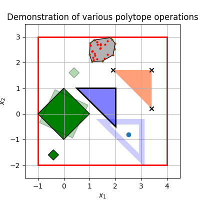
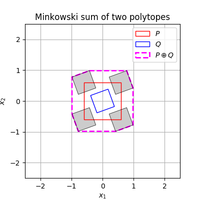
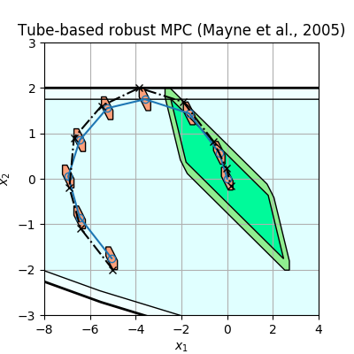

# pytope
Minimal package for operations on polytopes, zonotopes, and invariant sets.

The currently implemented features include 
* constructing polytopes from inequalites (halfspace representation), vertices, and upper and lower bounds, 
* linear mapping (multiplying a matrix M and a polytope P: M * P), 
* the Minkowski sum and Pontryagin difference of polytopes, 
* the intersection of polytopes, and
* simple plotting. 

The figures below are generated with pytope. 
The first two illustrate the currently implemented operations (see [demo.py](pytope/demo.py); the third uses pytope to plot a robust MPC trajectory (implemented in [CasADi](https://github.com/casadi), combining Figures 1 and 2 from Mayne et al. (2005) (with a rough approximation of the disturbance sequence). 

Most of pytope is experimental, fragile, largely untested, and buggy.

Figure: Illustration of various polytope operations.

Figure: The Minkowski sum of two polytopes.

Figure: Robust MPC trajectory from Mayne et al. (2005), combining Figures 1 and 2.

### References
* Mayne, D.Q., Seron, M.M., & Raković, S.V. (2005). Robust model predictive control of constrained linear systems with bounded disturbances. [*Automatica*, 41(2), 219–224](https://doi.org/10.1016/j.automatica.2004.08.019).
